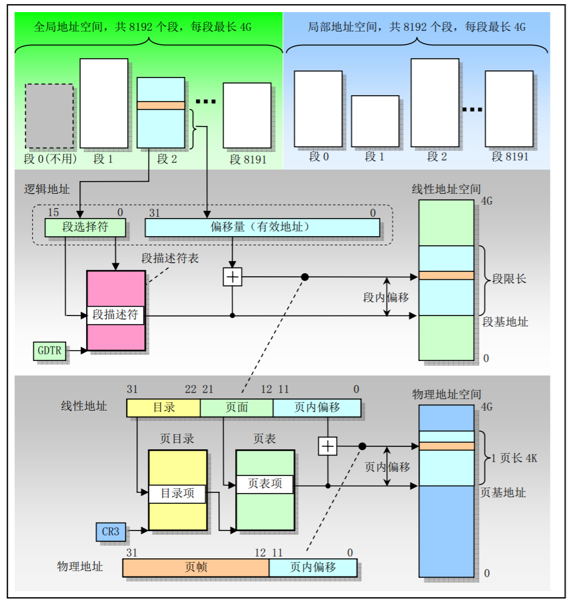
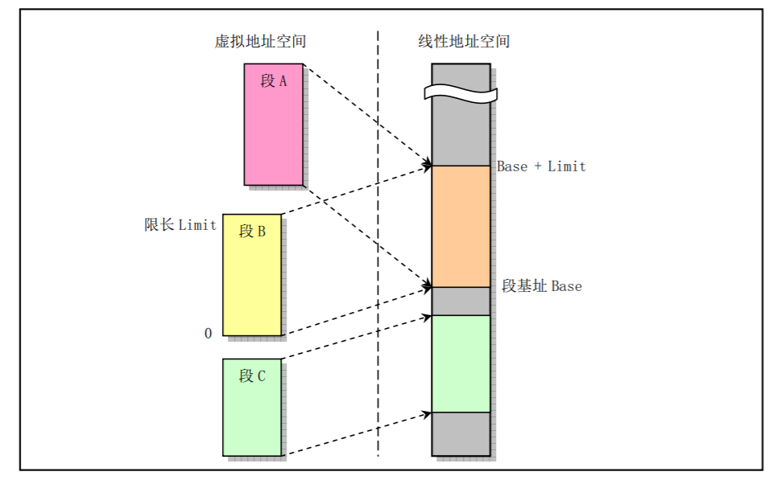
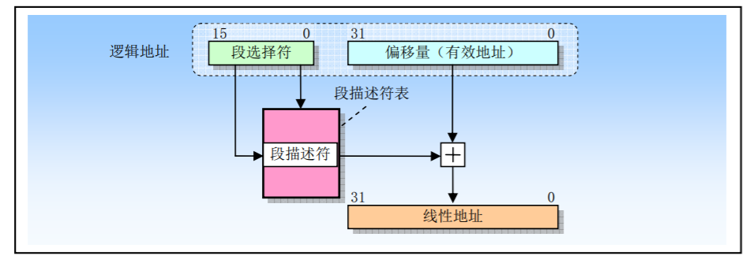
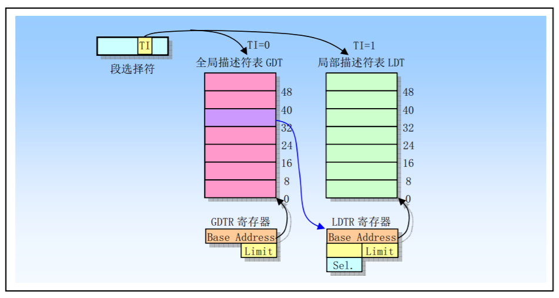
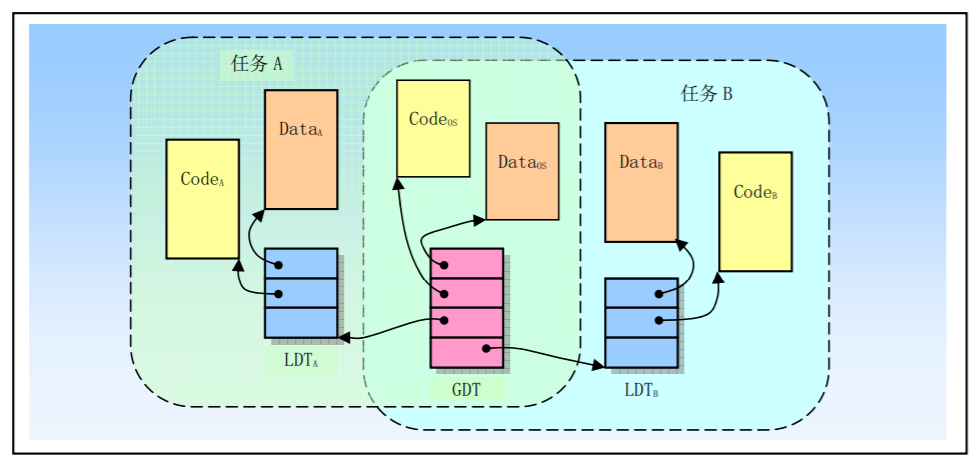
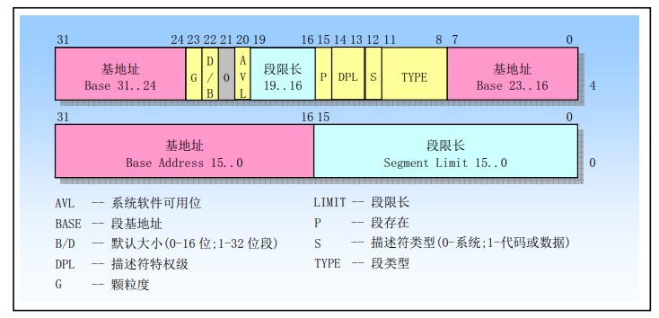
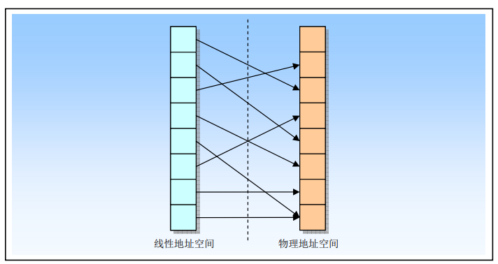
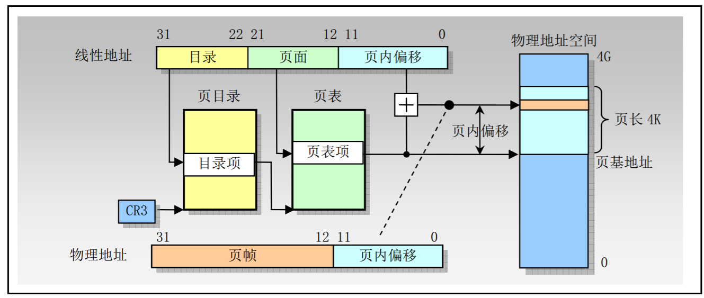
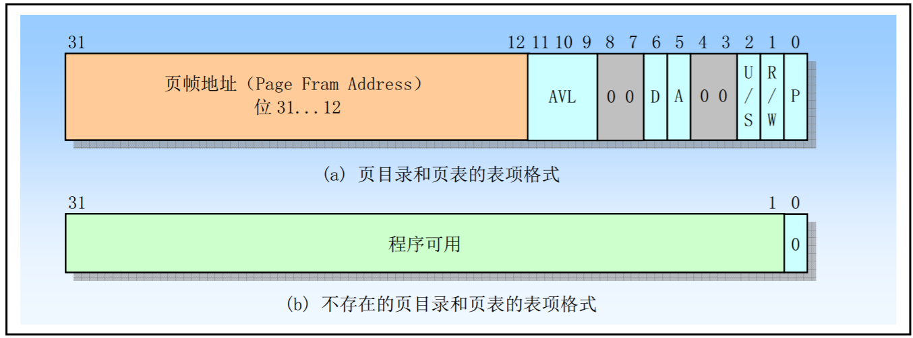

# 操作系统

## 80X86

### 寄存器

1. 标志寄存器
   - TF 位8 跟踪标志设置该位启动单步执行房市。
   - IOPL 位13-12 I/O特权级字段。该字段指明当前运行程序或任务的I/O特权级IOPL。当前运行程序或任务的CPL必须小于等于这个IOPL才能访问I/O地址空间。只有当CPL为特权级0时，程序才可以使用POPF或IRET指令修改这个字段。
   - NT 位14 嵌套任务标志
   - RF 位16 恢复标志。控制处理器对断点指令的响应。
   - VM 位17 虚拟-8086方式标志。当设置该标志时，就开启虚拟-8086方式；当复位该标志时，则回到保护模式
2. 内存管理寄存器
3. 控制寄存器

### 保护模式内存管理

1. 内存寻址

   段地址部分使用16位的段选择符指定，其中14位可以选择2^14次方即16384个段。段内偏移地址部分使用32位的值来指定，因此段内地址可以是0带4G。即一个段的最大长度可达4G。程序中由16位的段和32位的偏移构成的48位地址或长指针称为一个逻辑地址（虚拟地址）。它唯一确定了一个 数据对象的段地址和段内偏移地址。而仅由32位偏移地址或指针指定的地址是基于当前段的对象地址。

   偏移地址=基地址 + （变址 * 比例因子） + 偏移量

2. 地址变换

   内存管理系统都包含两个关键部分：保护和地址变换。提供保护措施是可以防止一个任务访问另一个任务或操作系统的内存区域。
   
   

3. 保护

   1. 任务之间的保护

      把每个任务放置在不同的虚拟地址空间中，并给予每个任务不同的逻辑地址到物理地址的变化映射。在80X86中，每个任务都有自己的段表和页表。当处理器切换去执行一个新任务时，任务切换的关键部分就是切换到新任务的变换表。

      通过在所有任务中安排具有相同的虚拟到物理地址映射的部分，并且把操作系统存储在这个公共的虚拟地址空间部分，操作系统可以被所有任务共享。这个所有任务都具有的相同虚拟地址空间部分被称位全局地址空间。
      
      每个任务唯一的虚拟地址空间部分被称为局部地址空间。局部地址空间含有需要与系统中其他任务区别开的私有代码和数据。
      
   2. 特权级保护
   
      在一个任务中，定义了4个执行特权级，用于依据段中含有数据的敏感度以及任务中不同程序部分的受信程度，来限制对任务中隔断的访问。
   
      特权级用数字0到3表示，0具有最高特权级，而3则是最低特权级。CPL就是当前活动代码段的特权级，并且他定义了当前所执行程序的特权级别。每当程序企图访问一个段时，当前特权级就会与段的特权级进行比较，以确定是否又访问许可。任何对高级别段的引用都是非法的，并且会引发一个异常来通知操作系统。
   
   ## 分段机制
   
   1. 段的定义
   
      虚拟地址空间中的虚拟地址（逻辑地址）由一个段部分和一个偏移部分构成。段是虚拟地址到线性地址转换机制的基础。每个段由三个参数定义：
   
      1. 段基地址，指定段在线性地址空间中的开始地址。基地址时线性地址，对于段中偏移0处。
      2. 段限长，时虚拟地址空间中段内最大可用偏移。它定义了段的长度。
      3. 段属性，指定段的特性。
   
      段的基地址，段限长以及段的保护属性存储在一个称为段描述符的结构项中。段描述符表是包含段描述符的一个简单数组。段选择符即用与通过指定表中的一个段描述符的位置来指定相应段。
   
      
   
      
   
      为了把逻辑地址转换成一个线性地址，处理器会执行以下操作：
   
      1. 使用段选择符中的编译值（段索引）在GDT或LDT表中定位相应的段描述符。（仅当一个新的段选择符加载到段寄存器时才需要这一步)
      2. 利用段描述符检验段的访问权限和范围，以确保该段是可访问并且偏移量处于段界限内。
      3. 把段描述符中取得的段基地址加上偏移量，最后形成一个线性地址。
   
      如果没有开启分页，那么处理器直接把线性地址映射到物理地址。
   
   2. 段描述符表
   
      段描述符表是段描述符的一个数组。描述符表长度可变，最多可以包含8192个8字节描述符。有两种描述符表：全局描述符表GDT；局部描述符表LDT。
   
      
   
      保存在仅由操作系统软件访问的受保护的内存区域中。整个虚拟地址空间共含有2^14个段：一半空间是由GDT映射的全局虚拟地址空间，另一半是由LDT映射的局部虚拟地址空间。通过指定一个描述符表（GDT或LDT）以及表中描述符号，我们就可以定位一个描述符。
   
      当发生任务切换时，LDT会更换成新任务的LDT，但是GDT并不会改变。
   
      
   
      每个系统必须定义一个GDT，并可用于系统中所有程序或任务。另外，可选定义一个或多个LDT。例如，可以为每个运行任务定义一个LDT，或者某些或所有任务共享一个LDT。
   
      GDT本身并不是一个段，而是线性地址空间中的一个数据结构。GDT的基线性地址和长度值必须加载进GDTR寄存器中。GDT的基地址应该进行内存8字节对齐，以得到最佳处理器性能。GDT的限长以字节为单位。与段类似，限长值加上基地址可得到最后表中最后一个字节的有效地址。因为段描述符总是8字节长，因此GDT的限长值应该设置为8N-1。
   
      处理器并不使用GDT中的第1个描述符。
   
      LDT表存放在LDT类型的系统段中。此时GDT必须含有LDT的段描述符。如果系统支持多LDT的话，那么每个LDT都必须在GDT中有一个段描述符和段选择符。一个LDT的段描述符可以存放在GDT表的任何地方。
   
      LDT的段选择符，基地址，段限长以及访问权限需要存放在LDTR寄存器中。
   
   3. 段选择符
   
      段选择符是段的16位标识符。段选择符并不直接指向段，二十指向段描述符表中定义段的段描述符。3个字段内容：
      
      - 请求特权级RPL 提供段保护信息
      
      - 表指示表示TI TI=0表示描述符在GDT中；TI=1表示在LDT中
      
      - 索引值 描述符在GDT或LDT表中的索引项号。
      
        
      
      选择符通过定位段表中的一个描述符来指定一个段，并且描述符中包含有访问一个段的所有信息，例如段的基地址、段长度和段属性。
      
      为减少地址转换时间和编程复杂性，处理器提供可存放最多6个段选择符的寄存器，即段寄存器。
      
      
      
      当一个段选择符被加载到一个段寄存器课件部分中时，处理器也同时把段选择符指向的段描述符中的段地址、段限长以及访问控制信息加载到段寄存器中的隐藏部分中。
      
   4. 段描述符
   
      段描述符时GDT和LDT表中的一个数据结构项，用于向处理器提供有关一个段的位置和大小信息以及访问控制的状态信息。每个段描述符长度是8字节，含有三个主要字段：段基地址、段限长和段属性。段描述符通常由编译器、链接器、加载器或者操作系统来创建，但绝不是应用程序。
   
      
      
      一个段描述符中各字段和标志的含义如下：
      
      - 段限长字段LIMIT
      
        段限长Limit字段用于指定段的长度。处理器会把段描述符中两个段限长字段组合成一个20位的值，并根据颗粒度标志G来指定段限长Limit值的实际含义。
      
      - 基地址字段BASE
      
        该字段定义在4GB线性地址空间中一个段字节0所处的位置。处理器会把3个分立的基地址字段组合形成一个32位的值。段基地址应该对齐16字节边界，让程序具有最佳性能。
      
      - 段类型字段TYPE
      
        类型字指定段或门的类型，说明类的访问种类以及段的扩展方向。 该字段的解释依赖于描述符类型标志S指明是一个应用描述符还是一个系统描述符。TYPE字段的编码对代码、数据或系统描述符都不同。
      
      - 描述符类型标志S
      
        描述符类型标志S指明一个段描述符是系统段描述符（S=0时）还是代码或数据段描述符（当S=1）。
      
      - 描述符特权级字符DPL
      
        DPL字符指明描述符的特权级。特权级范围从0到3。0级特权级最高，3级最低。DPL用于控制对段的访问。
      
      - 段存在标志P
      
        段存在标志P指出一个段时在内存中（P=1）还是不在内存中（P=0）。
      
      - D/B（默认操作大小/默认栈指针大小和/或上界限）标志
      
      - 颗粒度标志G
      
      - 可用和保留比特位
      
        段描述符第2个双字的位20可供系统软件使用；位21是保留位并应该总是设置位0。
      
   5. 代码和数据段描述符类型
   
      当段描述符中S（描述符类型）标志被置位，则该描述符用于代码或数据段。此时类型字段中最高比特位（第2个双字的位11）用于确定是数据段的描述符（复位）还是代码段的描述符（置位）。
   
   6. 系统描述符类型
   
      当段描述符中的S标志（描述符类型）是复位状态（0）的话，那么该描述符是一个系统描述符。处理器能识别以下一些类型的系统段描述符：
   
      - 局部描述符（LDT）的段描述符
      - 任务状态段（TSS）描述符
      - 调用门描述符
      - 中断门描述符
      - 陷阱门描述符
      - 任务门描述符
   
4. 分页机制

   分段机制把逻辑地址转换成线性地址，而分页则把线性地址转换成物理地址。

   通过设置控制寄存器CR0的PG位可以启用分页机制。如果PG=1，则启用分页操作。如果PG=0，则禁用分页机制，此时分段机制产生的线性的地址被直接用于物理地址。

   分页机制把线性和物理地址空间都划分成页面。线性地址空间中的任何页面都可以被映射到物理地址空间的任何页面上。

   

   80X86使用4K（2^12）字节固定大小的也i按。线性地址的低12bit可作为页内偏移量直接作为物理地址的低12位。分页机制执行的重定位功能可以看作是把线性地址的高20位转换到对于的物理地址的高20位。

   页面被标注位无效：

   1. 操作系统不支持的线性地址。产生无效地址的程序必须被终止
   2. 对应在虚拟内存系统中的页面在磁盘上而非物理内存中。请求操作系统虚拟内存管理器把对应页面从磁盘加载到物理内存中。

   在保护模式中，80X86允许线性地址空间直接映射到大容量的物理内存上，或者（使用分页）间接映射到较小容量的物理内存和磁盘存储空间中。后一种映射方法被称为虚拟存储或者需求也虚拟存储。

   为减少地址转换所要求的总线周期数量，最近访问的页目录和页表会被存放在处理器缓冲器件中，转换查找缓冲区（TLB）。

   - 页表结构

     页表中的每个页表项大小为32位。由于只需要其中20位来存放页面的物理基地址，因此剩下的12位可用于存放诸如页面是否存在等属性信息。

     - 两级页表结构

       为了减少内存占用量，80X86使用了两级表。由此，高20位线性地址到物理地址的转换也被分为两步来进行，每步使用其中10个比特。

       第一级表称为页目录。它被存放在1页的4K页面中，具有2^10（1K）个4字节长度的表项。这些表项指向对应的二级表。	线性地址的最高10位（位31-22）用作一级表（页目录）中的索引值来选择（2^10）个二级表之一。

       第二级表称为页表，它的长度也是1页，最多含有1K个4字节的表项。每个4字节表项含有相关页面的20位物理基地址。

       CR3寄存器指定页目录的基地址。线性地址的高10位用于索引这个页目录表，以获得指向相关第二级页表的指针。线性地址中间10位用于索引二级页表，以获得物理地址的高20位。线性地址的低12位直接作为物理地址低12位，从而组成一个完整的32位物理地址。

       

   - 页表项格式

     

     - P 位0 存在标志
     - R/W 位1 是读写标志
     - U/S 位2 是用户/超级用户标志
     - A 位5 是已访问标志
     - D 位6是页面已被修改标志

     - AVL 该字段保留专供程序使用

   - 虚拟存储

5. 保护

   